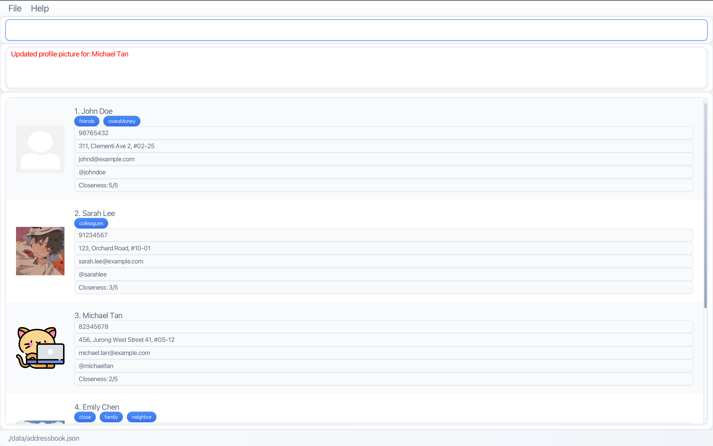

# About

* **UniContactsPro** is a desktop application with both a **Command Line Interface (CLI)** and a graphical user interface (GUI).
* It is designed for university students to manage and organize their contacts, helping them keep track of peers, professors, mentors, and CCA members in one place.
* The project is built as part of the CS2103T Software Engineering module, providing a well-structured codebase (around 6 KLoC) written in **object-oriented programming (OOP)** fashion.
* Key features:
  * **Contact Management**: Store, update, and delete contact information (name, phone, email, address, Telegram handle, profile pictures, etc.)
  * **Search & Filter**: Find contacts quickly by name or filter by tags
  * **Tag Organization**: Organize contacts into categories such as coursemates, professors, study groups, and CCA members
  * **Closeness Rating**: Rate relationships and sort contacts by closeness level
  * **Command History**: Navigate through previously executed commands using arrow keys
  * **Autocomplete**: Get real-time command suggestions as you type

* Example scenarios:
  * A student creates tag categories for professors to find them easily
  * A student searches for a project groupmate's contact information
  * A student sorts contacts by closeness to prioritize maintaining relationships
* For detailed documentation of this project, see the **[UniContactsPro Product Website](https://ay2526s1-cs2103t-f13-1a.github.io/tp/)**.
