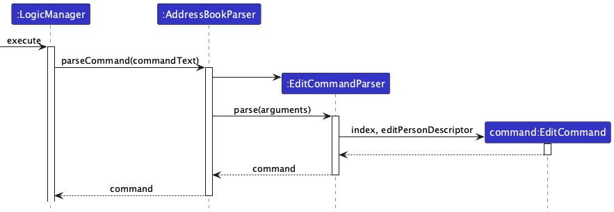
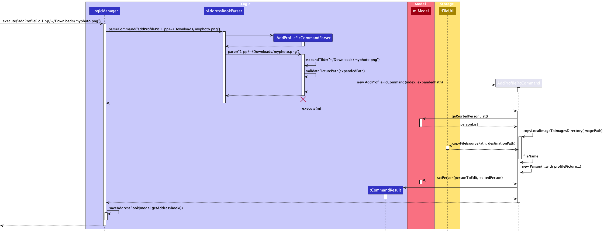
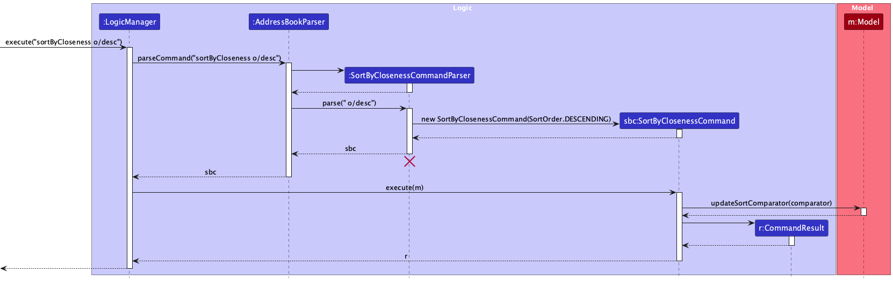
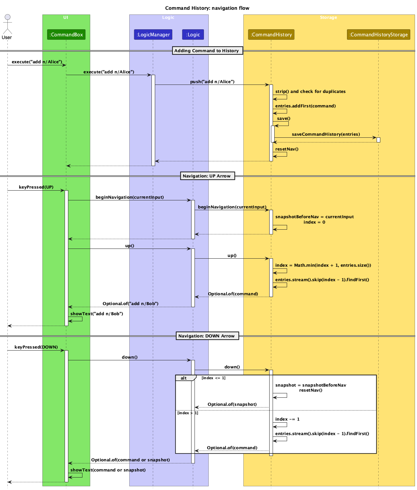
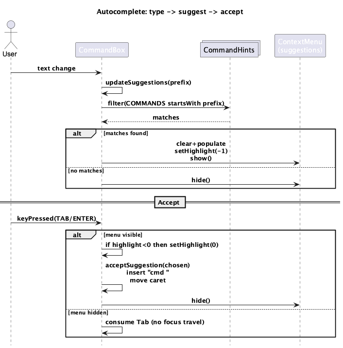

* Table of Contents
{:toc}

1. [Acknowledgements](#acknowledgements)
2. [Setting up, getting started](#setting-up-getting-started)
3. [Design](#design)
   - [Architecture](#architecture)
   - [UI component](#ui-component)
   - [Logic component](#logic-component)
   - [Model component](#model-component)
   - [Storage component](#storage-component)
   - [Common classes](#common-classes)
4. [Implementation](#implementation)
   - [[Proposed] Undo/redo feature](#proposed-undoredo-feature)
5. [Documentation, logging, testing, configuration, dev-ops](#documentation-logging-testing-configuration-dev-ops)
6. [Appendix: Requirements](#appendix-requirements)
   - [Product scope](#product-scope)
   - [User stories](#user-stories)
   - [Use cases](#use-cases)
   - [Non-Functional Requirements](#non-functional-requirements)
   - [Glossary](#glossary)
7. [Appendix: Instructions for manual testing](#appendix-instructions-for-manual-testing)
   - [Launch and shutdown](#launch-and-shutdown)
   - [Finding contacts by name](#finding-contacts-by-name)
   - [Filtering contacts by tag](#filtering-contacts-by-tag)
   - [Deleting contacts](#deleting-contacts)
   - [Sorting by closeness](#sorting-by-closeness)
   - [Adding/updating a profile picture](#addingupdating-a-profile-picture)
   - [Saving data](#saving-data)
8. [Appendix: Effort](#appendix-effort)
   - [Project Difficulty and Challenges](#project-difficulty-and-challenges)
   - [Major Effort Spent](#major-effort-spent)
   - [Reuse and Adaptation](#reuse-and-adaptation)
   - [Effort Estimate](#effort-estimate)
   - [Achievements](#achievements)
9. [Appendix: Planned Enhancements](#appendix-planned-enhancements)
   - [ZhengHao: UI Component Refinement and User Experience Enhancement](#zhenghao-ui-component-refinement-and-user-experience-enhancement)
   - [He Yue: Undo/Redo Feature Implementation](#he-yue-undoredo-feature-implementation)
   - [Gokul: SortByCloseness Feature Enhancement and Closeness Validation](#gokul-sortbycloseness-feature-enhancement-and-closeness-validation)
   - [Max: External Integration and Contact Synchronization](#max-external-integration-and-contact-synchronization)

--------------------------------------------------------------------------------------------------------------------

## **Acknowledgements**

- **AddressBook-Level3 (AB3) by SE-EDU** ([GitHub](https://github.com/se-edu/addressbook-level3), [Documentation](https://se-education.org/))
  - UniContactsPro is adapted from AB3, with extensive additions and customizations.
  - Documentation and diagrams (such as sequence/activity/class diagrams) and setup instructions were adapted from AB3 and SE-EDU documentation guides.
  - Project and codebase are licensed under the MIT License, as per AB3 and SE-EDU.

- **JavaFX** ([https://openjfx.io/]), **Jackson** ([https://github.com/FasterXML/jackson]), **JUnit5** ([https://junit.org/junit5/]) — Used as core libraries and tools.

- **Checkstyle** ([https://github.com/checkstyle/checkstyle]) — Used for code quality and style checking.

- **JaCoCo** ([https://www.jacoco.org/jacoco/]) — Used for Java code coverage analysis.

- **Gradle Shadow Plugin** ([https://github.com/johnrengelman/shadow]) — Used for building fat/uber jar files.

- **Jekyll** ([https://jekyllrb.com/]) — Used for static website generation and documentation.

- **AI-Assisted Development Tools** (e.g., GitHub Copilot, Cursor AI, Chatgpt)
  - Used to increase productivity in code writing through intelligent auto-completion and code suggestions.
  - Employed to generate alternative implementations of algorithms and code patterns for comparison and learning purposes, helping improve coding skills through iterative refinement.
  - Utilized for troubleshooting and debugging assistance to help locate problems and suggest solutions during development.

- **JavaFX 8 Tutorial by Marco Jakob**
  - Some code adapted for UI components: [JavaFX 8 Tutorial](http://code.makery.ch/library/javafx-8-tutorial/).

- **Icons and Images**
  - Susumu Yoshida ([address_book_32.png, AddressApp.ico](http://www.mcdodesign.com/))
  - Jan Jan Kovařík ([calendar.png, edit.png](http://glyphicons.com/))
  - See `copyright.txt`.

--------------------------------------------------------------------------------------------------------------------

## **Setting up, getting started**

Refer to the guide [_Setting up and getting started_](SettingUp.md).

--------------------------------------------------------------------------------------------------------------------

## **Design**

:bulb: **Tip:** The `.puml` files used to create diagrams are in this document `docs/diagrams` folder. Refer to the [_PlantUML Tutorial_ at se-edu/guides](https://se-education.org/guides/tutorials/plantUml.html) to learn how to create and edit diagrams.

### Architecture

The ***Architecture Diagram*** given above explains the high-level design of the App.

Given below is a quick overview of main components and how they interact with each other.

**Main components of the architecture**

**`Main`** (consisting of classes [`Main`](https://github.com/AY2526S1-CS2103T-F13-1a/tp/blob/master/src/main/java/seedu/address/Main.java) and [`MainApp`](https://github.com/AY2526S1-CS2103T-F13-1a/tp/blob/master/src/main/java/seedu/address/MainApp.java)) is in charge of the app launch and shut down.
* At app launch, it initializes the other components in the correct sequence, and connects them up with each other.
* At shut down, it shuts down the other components and invokes cleanup methods where necessary.

The bulk of the app's work is done by the following four components:

* [**`UI`**](#ui-component): The UI of the App.
* [**`Logic`**](#logic-component): The command executor.
* [**`Model`**](#model-component): Holds the data of the App in memory.
* [**`Storage`**](#storage-component): Reads data from, and writes data to, the hard disk.

[**`Commons`**](#common-classes) represents a collection of classes used by multiple other components.

**How the architecture components interact with each other**

The *Sequence Diagram* below shows how the components interact with each other for the scenario where the user issues the command `delete 1`.

Each of the four main components (also shown in the diagram above),

* defines its *API* in an `interface` with the same name as the Component.
* implements its functionality using a concrete `{Component Name}Manager` class (which follows the corresponding API `interface` mentioned in the previous point.

For example, the `Logic` component defines its API in the `Logic.java` interface and implements its functionality using the `LogicManager.java` class which follows the `Logic` interface. Other components interact with a given component through its interface rather than the concrete class (reason: to prevent outside component's being coupled to the implementation of a component), as illustrated in the (partial) class diagram below.

The sections below give more details of each component.

### UI component

The **API** of this component is specified in [`Ui.java`](https://github.com/AY2526S1-CS2103T-F13-1a/tp/blob/master/src/main/java/seedu/address/ui/Ui.java)

The UI consists of a `MainWindow` that is made up of parts e.g.`CommandBox`, `ResultDisplay`, `PersonListPanel`, `StatusBarFooter` etc. All these, including the `MainWindow`, inherit from the abstract `UiPart` class which captures the commonalities between classes that represent parts of the visible GUI.

The `UI` component uses the JavaFx UI framework. The layout of these UI parts are defined in matching `.fxml` files that are in the `src/main/resources/view` folder. For example, the layout of the [`MainWindow`](https://github.com/se-edu/addressbook-level3/tree/master/src/main/java/seedu/address/ui/MainWindow.java) is specified in [`MainWindow.fxml`](https://github.com/se-edu/addressbook-level3/tree/master/src/main/resources/view/MainWindow.fxml)

The `UI` component,

* executes user commands using the `Logic` component.
* listens for changes to `Model` data so that the UI can be updated with the modified data.
* keeps a reference to the `Logic` component, because the `UI` relies on the `Logic` to execute commands.
* depends on some classes in the `Model` component, as it displays `Person` object residing in the `Model`.

### Logic component

**API** : [`Logic.java`](https://github.com/AY2526S1-CS2103T-F13-1a/tp/blob/master/src/main/java/seedu/address/logic/Logic.java)

Here's a (partial) class diagram of the `Logic` component:

The sequence diagram below illustrates the interactions within the `Logic` component, taking `execute("delete 1")` API call as an example.

:information_source: **Note:** The lifeline for `DeleteCommandParser` should end at the destroy marker (X) but due to a limitation of PlantUML, the lifeline continues till the end of diagram.

How the `Logic` component works:

1. When `Logic` is called upon to execute a command, it is passed to an `AddressBookParser` object which in turn creates a parser that matches the command (e.g., `DeleteCommandParser`) and uses it to parse the command.
1. This results in a `Command` object (more precisely, an object of one of its subclasses e.g., `DeleteCommand`) which is executed by the `LogicManager`.
1. The command can communicate with the `Model` when it is executed (e.g. to delete a person). 
   Note that although this is shown as a single step in the diagram above (for simplicity), in the code it can take several interactions (between the command object and the `Model`) to achieve.
1. The result of the command execution is encapsulated as a `CommandResult` object which is returned back from `Logic`.

Here are some other sequence diagrams that illustrates the interactions within `Logic` component:

`sortByCloseness o/desc` Command

`AutocompleteSequenceDiagram` Command

Here are the other classes in `Logic` (omitted from the class diagram above) that are used for parsing a user command:

How the parsing works:
* When called upon to parse a user command, the `AddressBookParser` class creates an `XYZCommandParser` (`XYZ` is a placeholder for the specific command name e.g., `AddCommandParser`) which uses the other classes shown above to parse the user command and create a `XYZCommand` object (e.g., `AddCommand`) which the `AddressBookParser` returns back as a `Command` object.
* All `XYZCommandParser` classes (e.g., `AddCommandParser`, `DeleteCommandParser`, ...) inherit from the `Parser` interface so that they can be treated similarly where possible e.g, during testing.

In summary, this is how the sequence of each command looks like within `Logic` component:

### Model component
**API** : [`Model.java`](https://github.com/AY2526S1-CS2103T-F13-1a/tp/blob/master/src/main/java/seedu/address/model/Model.java)

The `Model` component,

* stores the address book data i.e., all `Person` objects (which are contained in a `UniquePersonList` object).
* stores the currently 'selected' `Person` objects (e.g., results of a search query) as a separate _filtered_ list which is exposed to outsiders as an unmodifiable `ObservableList<Person>` that can be 'observed' e.g. the UI can be bound to this list so that the UI automatically updates when the data in the list change.
* stores a `UserPref` object that represents the user’s preferences. This is exposed to the outside as a `ReadOnlyUserPref` objects.
* does not depend on any of the other three components (as the `Model` represents data entities of the domain, they should make sense on their own without depending on other components)

:information_source: **Note:** An alternative (arguably, a more OOP) model is given below. It has a `Tag` list in the `AddressBook`, which `Person` references. This allows `AddressBook` to only require one `Tag` object per unique tag, instead of each `Person` needing their own `Tag` objects. 

**Note**: A person is uniquely identified with **phone, email, and Telegram handle**.

### Storage component

**API** : [`Storage.java`](https://github.com/AY2526S1-CS2103T-F13-1a/tp/blob/master/src/main/java/seedu/address/storage/Storage.java)

The `Storage` component,
* can save both address book data and user preference data in JSON format, and read them back into corresponding objects.
* inherits from both `AddressBookStorage` and `UserPrefStorage`, which means it can be treated as either one (if only the functionality of only one is needed).
* depends on some classes in the `Model` component (because the `Storage` component's job is to save/retrieve objects that belong to the `Model`)

### Common classes

Classes used by multiple components are in the `seedu.address.commons` package.

--------------------------------------------------------------------------------------------------------------------

## **Implementation**

This section describes some noteworthy details on how certain features are implemented.

### \[Proposed\] Undo/redo feature

#### Proposed Implementation

The proposed undo/redo mechanism is facilitated by `VersionedAddressBook`. It extends `AddressBook` with an undo/redo history, stored internally as an `addressBookStateList` and `currentStatePointer`. Additionally, it implements the following operations:

* `VersionedAddressBook#commit()` — Saves the current address book state in its history.
* `VersionedAddressBook#undo()` — Restores the previous address book state from its history.
* `VersionedAddressBook#redo()` — Restores a previously undone address book state from its history.

These operations are exposed in the `Model` interface as `Model#commitAddressBook()`, `Model#undoAddressBook()` and `Model#redoAddressBook()` respectively.

Given below is an example usage scenario and how the undo/redo mechanism behaves at each step.

Step 1. The user launches the application for the first time. The `VersionedAddressBook` will be initialized with the initial address book state, and the `currentStatePointer` pointing to that single address book state.

Step 2. The user executes `delete 5` command to delete the 5th person in the address book. The `delete` command calls `Model#commitAddressBook()`, causing the modified state of the address book after the `delete 5` command executes to be saved in the `addressBookStateList`, and the `currentStatePointer` is shifted to the newly inserted address book state.

Step 3. The user executes `add n/David …​` to add a new person. The `add` command also calls `Model#commitAddressBook()`, causing another modified address book state to be saved into the `addressBookStateList`.

:information_source: **Note:** If a command fails its execution, it will not call `Model#commitAddressBook()`, so the address book state will not be saved into the `addressBookStateList`.

Step 4. The user now decides that adding the person was a mistake, and decides to undo that action by executing the `undo` command. The `undo` command will call `Model#undoAddressBook()`, which will shift the `currentStatePointer` once to the left, pointing it to the previous address book state, and restores the address book to that state.

:information_source: **Note:** If the `currentStatePointer` is at index 0, pointing to the initial AddressBook state, then there are no previous AddressBook states to restore. The `undo` command uses `Model#canUndoAddressBook()` to check if this is the case. If so, it will return an error to the user rather
than attempting to perform the undo.

The following sequence diagram shows how an undo operation goes through the `Logic` component:

:information_source: **Note:** The lifeline for `UndoCommand` should end at the destroy marker (X) but due to a limitation of PlantUML, the lifeline reaches the end of diagram.

Similarly, how an undo operation goes through the `Model` component is shown below:

The `redo` command does the opposite — it calls `Model#redoAddressBook()`, which shifts the `currentStatePointer` once to the right, pointing to the previously undone state, and restores the address book to that state.

:information_source: **Note:** If the `currentStatePointer` is at index `addressBookStateList.size() - 1`, pointing to the latest address book state, then there are no undone AddressBook states to restore. The `redo` command uses `Model#canRedoAddressBook()` to check if this is the case. If so, it will return an error to the user rather than attempting to perform the redo.

Step 5. The user then decides to execute the command `list`. Commands that do not modify the address book, such as `list`, will usually not call `Model#commitAddressBook()`, `Model#undoAddressBook()` or `Model#redoAddressBook()`. Thus, the `addressBookStateList` remains unchanged.

Step 6. The user executes `clear`, which calls `Model#commitAddressBook()`. Since the `currentStatePointer` is not pointing at the end of the `addressBookStateList`, all address book states after the `currentStatePointer` will be purged. Reason: It no longer makes sense to redo the `add n/David …​` command. This is the behavior that most modern desktop applications follow.

The following activity diagram summarizes what happens when a user executes a new command:

#### Design considerations:

**Aspect: How undo & redo executes:**

* **Alternative 1 (current choice):** Saves the entire address book.
  * Pros: Easy to implement.
  * Cons: May have performance issues in terms of memory usage.

* **Alternative 2:** Individual command knows how to undo/redo by
  itself.
  * Pros: Will use less memory (e.g. for `delete`, just save the person being deleted).
  * Cons: We must ensure that the implementation of each individual command are correct.

### \[Implemented\] Add Profile Picture feature

#### Implementation

The add profile picture mechanism is facilitated by `AddProfilePicCommand`. It extends `Command` with the ability to add or update profile pictures for persons in the address book. Additionally, it implements the following operations:

* `AddProfilePicCommand#execute()` — Updates the profile picture of the person at the specified index.
* `AddProfilePicCommand#copyLocalImageToImagesDirectory()` — Copies a local image file to the `docs/images` directory.
* `AddProfilePicCommand#generateUniqueFilename()` — Generates a unique filename to avoid conflicts.

The command is parsed by `AddProfilePicCommandParser`, which handles argument tokenization and path validation. The parser supports:
* Local file paths (absolute or relative paths, with support for `~` expansion for home directory)
* Existing images in the `docs/images` directory (specified by filename only)

Given below is an example usage scenario and how the add profile picture mechanism behaves at each step.

Step 1. The user executes `addProfilePic 1 pp/~/Downloads/myphoto.png` to add a profile picture from their local Downloads directory. The `AddProfilePicCommandParser` parses the command and expands the `~` to the user's home directory.

Step 2. The parser validates that the file exists at the specified path and checks that it's not a directory. If validation passes, an `AddProfilePicCommand` is created with the index and expanded path.

Step 3. The `AddProfilePicCommand#execute()` method is called. It retrieves the person at the specified index from the displayed list.

Step 4. Since the path contains `/` or `\`, the command identifies this as a local file path. It calls `copyLocalImageToImagesDirectory()` to:
   * Validate that the file is a `.png` file
   * Generate a unique filename (checking if it already exists in `docs/images`)
   * Copy the file from the source location to `docs/images`
   * Return the filename for storage

Step 5. The command creates a new `Person` object with all the original fields, but with the new profile picture filename set.

Step 6. The model updates the person using `Model#setPerson()`, replacing the old person with the new one containing the profile picture.

:information_source: **Note:** If the user specifies only a filename (e.g., `pp/johndoe.png`), the command assumes the image already exists in `docs/images` and uses it directly without copying. The parser validates that the file exists before creating the command.

:information_source: **Note:** If a file with the same name already exists in `docs/images`, the command throws an exception instructing the user to use the existing file directly by specifying only the filename.

The following sequence diagram shows how an add profile picture operation works:

#### Design considerations:

**Aspect: How to handle image storage:**

* **Alternative 1 (current choice):** Store images in `docs/images` directory and reference by filename.
  * Pros: Simple to implement, images are easily accessible, supports relative paths for documentation.
  * Cons: Requires copying files, may lead to file conflicts if not handled properly.

* **Alternative 2:** Store full file paths in the Person object.
  * Pros: No need to copy files, original file location is preserved.
  * Cons: Files may be moved or deleted, breaking references. Harder to share address book data.

**Aspect: Image format support:**

* **Alternative 1 (current choice):** Only support `.png` files.
  * Pros: Consistent format, simple validation.
  * Cons: Users may have images in other formats that need conversion.

* **Alternative 2:** Support multiple image formats (JPG, PNG, GIF, etc.).
  * Pros: More flexible for users.
  * Cons: Requires more complex validation and potentially conversion logic.

### \[Implemented\] Sort By Closeness feature

#### Implementation

The sort by closeness mechanism is facilitated by `SortByClosenessCommand`. It extends `Command` with the ability to sort the contact list by closeness rating in either ascending or descending order. Additionally, it implements the following operations:

* `SortByClosenessCommand#execute()` — Updates the sort comparator in the model.
* `SortByClosenessCommand#SortOrder` — An enumeration representing ascending or descending sort order.

The command is parsed by `SortByClosenessCommandParser`, which validates the order parameter (`o/asc` or `o/desc`) and creates a `SortByClosenessCommand` with the appropriate `SortOrder`.

Given below is an example usage scenario and how the sort by closeness mechanism behaves at each step.

Step 1. The user executes `sortByCloseness o/desc` to sort contacts by closeness in descending order (highest closeness first). The `SortByClosenessCommandParser` parses the command and validates that `desc` is a valid order.

Step 2. The parser creates a `SortByClosenessCommand` with `SortOrder.DESCENDING`. The command constructor creates a comparator that:
   * Extracts the `closenessLevel` from each person's `Closeness` object
   * Compares persons based on their closeness level
   * Reverses the order for descending sort

Step 3. The `SortByClosenessCommand#execute()` method is called. It calls `Model#updateSortComparator()` with the created comparator.

Step 4. The model updates its internal sorted person list by setting the comparator on the `sortedPersons` observable list. This triggers a re-sort of the displayed list.

Step 5. The UI automatically reflects the new sort order since it observes the `sortedPersons` list.

:information_source: **Note:** The sorting is applied to the `sortedPersons` list, which is the list displayed to users. This list is separate from the `filteredPersons` list, allowing sorting to work independently of filtering.

:information_source: **Note:** The `list` command resets the sort comparator to `null`, restoring the default order of the contact list.

The following sequence diagram shows how a sort by closeness operation works:

#### Design considerations:

**Aspect: How to implement sorting:**

* **Alternative 1 (current choice):** Use a comparator that is applied to an observable list.
  * Pros: Integrates well with JavaFX's observable collections, automatically updates UI when sort changes.
  * Cons: Requires maintaining a separate sorted list.

* **Alternative 2:** Sort the list directly and replace it.
  * Pros: Simpler implementation, no need for separate sorted list.
  * Cons: May cause UI flickering, less efficient for large lists.

**Aspect: Persistence of sort order:**

* **Alternative 1 (current choice):** Sort order is not persisted, resets on `list` command.
  * Pros: Simple, predictable behavior.
  * Cons: Users need to re-sort if they want the same order again.

* **Alternative 2:** Persist sort order in user preferences.
  * Pros: Better user experience, maintains sort preference across sessions.
  * Cons: More complex, requires additional storage logic.

### \[Implemented\] Command History feature

#### Implementation

The command history mechanism is facilitated by `CommandHistory`. It manages a history of previously executed commands, allowing users to navigate through their command history using arrow keys. Additionally, it implements the following operations:

* `CommandHistory#push()` — Adds a command to history (disallows consecutive duplicates).
* `CommandHistory#up()` — Navigates to the previous (older) command in history.
* `CommandHistory#down()` — Navigates to the next (newer) command in history.
* `CommandHistory#beginNavigation()` — Initializes navigation state with current input.
* `CommandHistory#save()` — Persists command history to storage.

The command history is stored using `CommandHistoryStorage`, which reads from and writes to a file (`data/command_history.txt`). The history is loaded when `CommandHistory` is initialized and saved whenever a new command is added.

Given below is an example usage scenario and how the command history mechanism behaves at each step.

Step 1. The user launches the application. The `CommandHistory` is initialized with a maximum size (default 500) and loads any existing history from storage into an `ArrayDeque`, with the newest commands at the front.

Step 2. The user executes several commands: `add n/Alice`, `add n/Bob`, `list`. Each command calls `CommandHistory#push()` through `LogicManager#execute()`, which:
   * Strips whitespace and checks if the command is empty
   * Prevents consecutive duplicates (if the same command was just executed)
   * Adds the command to the front of the deque
   * Removes old commands if the size exceeds `maxSize`
   * Saves the history to storage
   * Resets navigation state

Step 3. The user starts typing a new command but presses the UP arrow key. The `CommandBox` calls `CommandHistory#beginNavigation()` with the current input (if not already in navigation mode) to save a snapshot of what the user was typing.

Step 4. The `CommandBox` calls `CommandHistory#up()`, which:
   * Checks if history is empty (returns empty if so)
   * Increments the internal navigation index
   * Returns the command at that position in history
   * The `CommandBox` displays this command in the text field

Step 5. The user presses UP again to go further back in history. The index increments and the next older command is retrieved and displayed.

Step 6. The user presses DOWN to go forward in history. The `CommandBox` calls `CommandHistory#down()`, which:
   * Decrements the navigation index
   * Returns the command at that position
   * If the index reaches 1 or less, it returns the snapshot text (what the user was originally typing) and resets navigation

Step 7. The user presses DOWN again when at the snapshot, which resets navigation completely and returns the snapshot text.

:information_source: **Note:** The navigation state (`index` and `snapshotBeforeNav`) is reset when a command is executed, ensuring that starting navigation always begins from the user's current input.

:information_source: **Note:** Consecutive duplicate commands are not stored in history. This prevents the history from being cluttered with repeated commands like `list` executed multiple times in a row.

The following sequence diagram shows how command history navigation works:

#### Design considerations:

**Aspect: How to store command history:**

* **Alternative 1 (current choice):** Use an `ArrayDeque` with newest at front, persisted to file.
  * Pros: Efficient for adding new commands, easy to navigate backwards, persists across sessions.
  * Cons: Requires file I/O operations.

* **Alternative 2:** Store in memory only, using a simple list.
  * Pros: Faster, no file I/O overhead.
  * Cons: History is lost when application closes.

**Aspect: How to handle navigation:**

* **Alternative 1 (current choice):** Use an index-based approach with snapshot of current input.
  * Pros: Allows returning to what user was typing, smooth navigation experience.
  * Cons: Requires maintaining navigation state.

* **Alternative 2:** Store current input separately and always navigate from history.
  * Pros: Simpler implementation.
  * Cons: User loses their current input when navigating, worse user experience.

### Autocomplete feature

#### Implementation

The autocomplete mechanism is facilitated by `CommandHints` and implemented in `CommandBox`. It provides real-time command suggestions as users type, helping them discover available commands. Additionally, it implements the following operations:

* `CommandBox#updateSuggestions()` — Filters and displays matching commands based on current input.
* `CommandBox#buildMatches()` — Filters commands from `CommandHints.COMMANDS` that start with the current prefix.
* `CommandBox#acceptSuggestion()` — Inserts a selected suggestion into the command box.

The autocomplete feature uses a `ContextMenu` (suggestions menu) that appears below the command box as the user types. It filters commands from `CommandHints.COMMANDS`, which contains all valid command words.

Given below is an example usage scenario and how the autocomplete mechanism behaves at each step.

Step 1. The user starts typing in the command box. The `CommandBox` has a text property listener that calls `updateSuggestions()` whenever the text changes.

Step 2. The user types `"add"`. The `updateSuggestions()` method:
   * Takes the trimmed input as a prefix
   * Calls `buildMatches()` which filters `CommandHints.COMMANDS` for commands starting with `"add"` (case-insensitive)
   * Finds matches: `["add", "addProfilePic"]`
   * Since there are multiple matches, it populates the suggestions menu and displays it

Step 3. The suggestions menu appears below the command box with the matching commands. The user can:
   * Use UP/DOWN arrow keys to navigate through suggestions
   * Press TAB or ENTER to accept the highlighted (or first) suggestion
   * Continue typing to further filter suggestions
   * Press ESCAPE to hide the menu

Step 4. The user types `"Pro"` to get `"addPro"`. The suggestions are filtered further, now only showing `["addProfilePic"]` if it matches.

Step 5. If the user's input exactly matches a single command (e.g., `"add"` when only `"add"` matches), the suggestions menu is hidden automatically to avoid cluttering the UI.

Step 6. The user presses TAB to accept the highlighted suggestion. The `acceptSuggestion()` method:
   * Replaces the current text with the selected command word followed by a space
   * Positions the cursor after the inserted text
   * Hides the suggestions menu

:information_source: **Note:** The autocomplete only suggests command words, not full commands with parameters. Users still need to type the parameters themselves after accepting a suggestion.

:information_source: **Note:** The suggestions menu is limited to 8 matches maximum to prevent overwhelming the user with too many options.

The following sequence diagram shows how autocomplete works:

#### Design considerations:

**Aspect: How to maintain command list:**

* **Alternative 1 (current choice):** Maintain a static list in `CommandHints` class.
  * Pros: Simple, centralized location, easy to keep in sync with commands.
  * Cons: Requires manual updates when new commands are added.

* **Alternative 2:** Dynamically discover commands using reflection or command registry.
  * Pros: Automatically includes new commands, no manual maintenance.
  * Cons: More complex, potential performance overhead, may include internal commands.

**Aspect: When to show suggestions:**

* **Alternative 1 (current choice):** Show suggestions as user types, hide on exact single match.
  * Pros: Provides immediate feedback, helps discover commands.
  * Cons: May be distracting for experienced users.

* **Alternative 2:** Only show suggestions on explicit trigger (e.g., Ctrl+Space).
  * Pros: Less distracting, gives user control.
  * Cons: Users may not discover the feature, requires extra key press.

--------------------------------------------------------------------------------------------------------------------

## **Documentation, logging, testing, configuration, dev-ops**

* [Documentation guide](Documentation.md)
* [Testing guide](Testing.md)
* [Logging guide](Logging.md)
* [Configuration guide](Configuration.md)
* [DevOps guide](DevOps.md)

--------------------------------------------------------------------------------------------------------------------

## **Appendix: Requirements**

### Product scope

**Target user profile**:

* has a need to manage a significant number of contacts
* prefer desktop apps over other types
* can type fast
* prefers typing to mouse interactions
* is reasonably comfortable using CLI apps
* undergraduate student

**Value proposition**: It helps undergraduates keep track of school contacts, making it easier to remember acquaintances they don’t interact with often. The app acts like a personalized contact book designed for students, ensuring connections are organized and accessible when needed.

### User stories

Priorities: High (must have) - `* * *`, Medium (should have) - `* *`, Low (nice to have) - `*`

| Priority | As a …           | I want to …                                                      | So that I can …                                                     |
|----------|------------------|------------------------------------------------------------------|----------------------------------------------------------------------|
| * * *    | user             | search for a contact by name or tag                              | quickly find the contact I need                                     |
| * * *    | user             | view the contact list                                            | see all my contacts at a glance                                     |
| * * *    | user             | add a contact                                                    | keep new people I meet in my address book                           |
| * * *    | user             | delete a contact                                                 | remove entries I no longer need                                     |
| * * *    | user             | edit a contact                                                   | keep contact details up to date                                     |
| * *      | user             | filter my contacts by tag                                        | find people in specific groups easily                               |
| * *      | user             | create a new tag                                                 | categorize my contacts the way I want                               |
| * *      | user             | delete an existing tag                                           | clean up tags I no longer use                                       |
| * *      | student          | search for coursemates in the same tutorial                      | find group mates for a project                                      |
| * *      | user             | search by first few characters of name                           | find my friends quicker                                             |
| * *      | user             | merge duplicate contacts                                         | organize my list by combining duplicates                            |
| * *      | user             | assign multiple tags to each contact                             | find them via multiple categories                                   |
| *        | new user         | view the user guide easily                                       | learn more about the product whenever I need                        |
| *        | experienced user | pin important contacts to the top of my address book             | access them quickly                                                 |
| *        | student          | add a profile picture to my profile or another contact's profile | recognize and recall people more easily                             |
| *        | user             | add notes about a person                                         | remember details about where and when I met them                    |
| *        | user             | indicate how close a person is to me                             | make efforts to contact closer friends more regularly               |
| *        | user             | log interactions with a contact                                  | keep track of how often I connect with them                         |
| *        | user             | sort my contacts by date added                                   | catch up with old or new friends                                    |
| *        | user             | import contacts from my phone and email                          | avoid typing them manually                                          |
| *        | user             | export (filtered) contact list as a CSV file                     | share and store it externally                                       |
| *        | user             | be reminded to maintain connections                              | catch up with friends I haven’t talked to for ~2 months             |
| *        | user             | create and switch between custom themes                          | customize the app’s appearance to my liking                         |

### Use cases

(For all use cases below, the **System** is the `UniContactsPro` and the **Actor** is the `user`, unless specified otherwise)

**Use case: Delete a contact**

**MSS**

1.  User requests to list persons
2.  UniContactsPro shows a list of persons
3.  User requests to delete a specific person in the list
4.  UniContactsPro deletes the person

    Use case ends.

**Extensions**

* 2a. The list is empty.

  Use case ends.

* 3a. The given index is invalid.

    * 3a1. AddressBook shows an error message.

      Use case resumes at step 2.

**Use case: Add a contact**

**MSS**

1.  User requests to create a person based on their name, phone number, email address, date, profile picture (optional)
2.  UniContactsPro adds a person
3.  UniContactsPro displays the updated list of contacts
    Use case ends.

**Extensions**

* 2a. The command does not follow the command format

  * 2a1. UniContactsPro shows an error message

    Use case ends.

**Use case: List all contacts**

**MSS**

1.  User requests to list all contacts in UniContactsPro at that point in time.
2.  UniContactsPro displays current list of contacts.

**Extensions**

* 2a. The command does not follow the command format

    * 2a1. UniContactsPro shows an error message

      Use case ends.

**Use case: Exit**

**MSS**

1.  User requests to exit UniContactsPro
2. UniContactsPro exits

**Extensions**

* 2a. The command does not follow the command format

    * 2a1. UniContactsPro shows an error message

      Use case ends.

### Non-Functional Requirements

1. Should work on any mainstream OS with Java 17+.
2. Should store up to 1000+ contacts with tags without sluggishness.
3. A student with above-average typing speed should be able to manage contacts faster via CLI than GUI.
4. Should load the contact list within 2 seconds for up to 1000 entries.
5. Should persist data locally so that contacts are not lost after application shutdown.
6. Should have a consistent and intuitive command syntax (e.g., `add`, `delete`, `list`).
7. Should prevent accidental data corruption by validating input before saving.
8. Should allow undo/redo of recent commands for error recovery.
9. Should not require an internet connection for core features (offline-first).
10. Should allow exporting data (e.g., CSV) in under 3 seconds for 500 contacts.
11. Should provide error messages that are clear and easy for students to understand.
12. Should be maintainable by new developers, with clear documentation and modular design.
13. Should be extensible to add new features (e.g., reminders, themes) without major refactoring.
14. Should ensure tags/categories remain consistent (no duplicates unless explicitly allowed).
15. Should recover gracefully from corrupted storage files (e.g., reset to last known good state).
16. Should support basic accessibility, e.g., adjustable font size in the GUI.
17. Should consume no more than 200MB of RAM during typical usage with 1000 contacts.

### Glossary

* **Mainstream OS**: Windows, Linux, Unix, MacOS
* **CLI (Command Line Interface)**: A text-based interface where users type commands (e.g., `add`, `list`, `delete`) to interact with the app.
* **Contact**: An individual entry in the address book, typically containing a name, phone number, email, and optional tags.

--------------------------------------------------------------------------------------------------------------------

## **Appendix: Instructions for manual testing**

Given below are instructions to test the app manually.

:information_source: **Note:** These instructions only provide a starting point for testers to work on;
testers are expected to do more *exploratory* testing.

### Launch and shutdown

1. Initial launch

   1. Download the jar file and copy into an empty folder

   1. Double-click the jar file Expected: Shows the GUI with a set of sample contacts. The window size may not be optimum.

1. Saving window preferences

   1. Resize the window to an optimum size. Move the window to a different location. Close the window.

   1. Re-launch the app by double-clicking the jar file. 
       Expected: The most recent window size and location is retained.

### Finding contacts by name

1. Prerequisites: Multiple persons in the list.

   1. Test case: `find alex david` 
      Expected: Lists contacts whose names contain "alex" or "david" (case-insensitive). Status shows the number of persons listed.

   1. Test case: `find` (empty) 
      Expected: Error message with usage: `find KEYWORD [MORE_KEYWORDS]...`.

### Filtering contacts by tag

1. Prerequisites: At least some contacts have tags (e.g., `friends`, `colleagues`).

   1. Test case: `filter t/friends` 
      Expected: Only contacts with the `friends` tag are shown. Status shows number of persons listed.

   1. Test case: `filter t/friends t/colleagues` 
      Expected: Shows contacts that have at least one of the tags `friends` or `colleagues`.

   1. Test case: `filter` (missing tag prefixes) or `filter friends` (missing `t/`) 
      Expected: Error message with usage: `filter t/KEYWORD [t/MORE_KEYWORDS]...`.

### Deleting contacts

1. Deleting by displayed indices

   1. Prerequisites: List all persons using the `list` command. Multiple persons in the list.

   1. Test case: `delete 1` 
      Expected: First contact is deleted. Details of the deleted contact shown in the result message. Timestamp in the status bar is updated.

   1. Test case: `delete 1 2 2 5` 
      Expected: Contacts at indices 1, 2, and 5 are deleted (duplicates ignored). Result message lists all deleted persons.

   1. Test case: `delete 0` or `delete 999` (index out of range) 
      Expected: Error message: invalid person displayed index. No one is deleted.

2. Deleting all contacts matching tags (union)

   1. Prerequisites: Multiple persons in the list, with tags set (e.g., `friends`, `noisy`).

   1. Test case: `delete all t/friends` 
      Expected: All currently displayed contacts having the `friends` tag are deleted. Result message lists all deleted persons.

   1. Test case: `delete all t/superhero t/noisy` 
      Expected: Deletes all currently displayed contacts that have either `superhero` or `noisy`. If none match, shows: `No persons found with tag(s): superhero, noisy`.

   1. Test case: `delete all` (no `t/` provided) 
      Expected: Error with usage instructions.

### Sorting by closeness

1. Prerequisites: Contacts have a closeness rating set.

   1. Test case: `sortByCloseness o/asc` 
      Expected: List is sorted by closeness in ascending order. Result message: `Sorted contact list by closeness (ascending)`.

   1. Test case: `sortByCloseness o/desc` 
      Expected: List is sorted by closeness in descending order. Result message: `Sorted contact list by closeness (descending)`.

   1. Test case: `sortByCloseness` or `sortByCloseness o/invalid` 
      Expected: Error message with usage: `sortByCloseness: Parameters: o/{asc|desc}`.

### Adding/updating a profile picture

1. Prerequisites: At least one person exists in the list (index 1 available). Ensure you have a `.png` image at `~/Downloads/example.png`.

   1. Test case (copy from local path): `addProfilePic 1 pp/~/Downloads/example.png` 
      Expected: The image is copied into `docs/images/` with a unique filename. Contact 1 shows the updated profile picture. Success message includes the contact name. Only `.png` is accepted.

   1. Test case (use existing filename already in docs/images): `addProfilePic 1 pp/example.png` 
      Expected: Uses existing image `docs/images/example.png`. Profile picture updated. Success message shown.

   1. Test case (non-PNG): `addProfilePic 1 pp/~/Downloads/example.jpg` 
      Expected: Error message: only `.png` images are supported.

   1. Test case (file already exists in docs/images when copying): ensure `docs/images/example.png` exists, then run `addProfilePic 1 pp/~/Downloads/example.png` 
      Expected: Error message indicating the file already exists in `docs/images` and how to reference it directly using `pp/<image name>`.

   1. Test case (invalid index): `addProfilePic 0 pp/example.png` or `addProfilePic 999 pp/example.png` 
      Expected: Error message: invalid person displayed index.

### Saving data

1. Dealing with missing/corrupted data files

   1. Missing file
      - Close the app. Delete `data/addressbook.json`.
      - Launch the app. 
        Expected: App starts with an empty list (or sample data if the app provides it). No crash.

   1. Corrupted file
      - Close the app. Open `data/addressbook.json` in a text editor and replace its contents with an invalid JSON (e.g., `{ not: valid }`). Save the file.
      - Launch the app. 
        Expected: App handles the error gracefully and starts with an empty list (no crash). Consider checking logs for a warning about corrupted storage.

--------------------------------------------------------------------------------------------------------------------

## Appendix: Effort

This appendix summarizes the total effort and achievements for UniContactsPro, to facilitate evaluation.

### Project Difficulty and Challenges
- **Complexity Beyond AB3**: While AB3 comprises mostly single-entity (Person) management, UniContactsPro extends or customizes many features (such as tagging, closeness, profile pictures, filtering, and reminders) requiring broader and deeper changes to the model, parser, command, and UI layers.
- **JavaFX Customizations**: Significant effort was spent modernizing the UI, introducing new FXML views, and handling advanced JavaFX behaviors such as theme switching and dynamic filtering, which go beyond the base AB3 layout.
- **Data Model Enhancements**: Many new attributes (profile picture, closeness, handle) and features such as multiple tags, filtering, advanced searching, and custom sorting increased the challenge compared to AB3’s flat data structure.
- **Code Quality and Testing**: Maintaining high-quality code, documentation, and extensive unit and integration testing for all new features to ensure the product remains robust and extensible.

### Major Effort Spent
- Requirements gathering, architecture planning, and design revisions to support student-specific features (e.g., coursemate search, reminders, tracking last contacted date).
- Implementing and integrating new commands for tags, themes, closeness, and profile pictures, each requiring multi-layer changes (parser, command, UI, storage, model).
- Manual and automated testing (unit, system, and acceptance).
- Updating and maintaining comprehensive documentation and diagrams for all new behaviors and structural changes.

### Reuse and Adaptation
- **SE-EDU AB3 Base: Significant Reuse**: Core infrastructure (logic, UI, storage patterns) and some commands are inherited/adapted from AB3. This saved foundational setup effort.
    - However, most major features added required rewriting or significant refactoring of nearly all subsystems (model, command, UI, storage, test).
    - Examples: Tagging, profile pictures, reminders, and custom filters required original solutions, test cases, and new classes.
- **Third-party libraries (JavaFX, Jackson, JUnit, Jekyll)** provided building blocks (GUI, JSON handling, testing, docs), saving development time on those core functionalities.
- **Attribution Transparency**: All reused code/assets were documented (see Acknowledgements) and integrated according to open-source licensing requirements. Where adaptation was significant (e.g., UI components or advanced command parsing), new code was written.

### Effort Estimate
- The bulk of team effort was focused on:
    - Modifying the data model for greater extensibility and richer user experience
    - Implementing, testing, and documenting new or enhanced CLI commands and UI workflows
    - Ensuring a seamless, robust, and user-friendly application beyond AB3 capabilities
- **Estimated AB3 Reuse Impact**: Foundational AB3 code (~20-30% of the codebase) provided basic address book structure; however, over 70% of features, logic, UI, and documentation reflect new or heavily extended work.

### Achievements
- UniContactsPro delivers features highly tailored to undergraduate student needs (tracking, reminders, advanced filtering), all integrated in a modernized, user-friendly, and extensible JavaFX application.
- Our team successfully tackled technical and design challenges across multiple software layers, upholding strong software engineering and documentation standards.

## Appendix: Planned Enhancements

### **ZhengHao: UI Component Refinement and User Experience Enhancement**

**Objective:** Enhance the UI component architecture and improve user experience through systematic UI/UX improvements while maintaining separation of concerns between the UI, Logic, and Model layers.

**Implementation Scope:**
* **Component-Level Improvements:** Refactor existing `UiPart` subclasses (`MainWindow`, `PersonListPanel`, `CommandBox`, `ResultDisplay`) to implement responsive layout constraints using JavaFX `Bindings` API for dynamic resizing. Integrate ObservableList listeners to provide real-time visual feedback when `Model` data changes.
* **Accessibility Enhancements:** Implement keyboard navigation handlers in `MainWindow` to support accessibility standards, and extend `UserPrefs` storage to persist user-defined font size preferences. Create a `ThemeManager` utility class following the Singleton pattern to manage theme switching while ensuring proper resource cleanup.
* **Visual Feedback Mechanisms:** Add loading indicators and command execution status visualization by extending the `CommandResult` class to include execution metadata (success/failure states, execution time). Implement toast notifications using JavaFX `Tooltip` or custom `NotificationPane` components.
* **Code Quality:** Ensure all UI enhancements follow the existing dependency injection pattern where UI components depend on `Logic` and `Model` interfaces, not concrete implementations. Maintain backward compatibility with existing FXML layouts while introducing enhanced CSS styling.

**Testing Strategy:** Develop unit tests for UI component behavior using `TestFX` framework, and create integration tests verifying UI-Model synchronization through observable list updates.

### **He Yue: Undo/Redo Feature Implementation**

**Objective:** Complete the implementation of the version control mechanism for address book state management as outlined in the proposed undo/redo feature specification.

**Implementation Scope:**
* **Core Architecture:** Implement the `VersionedAddressBook` class extending `AddressBook` to maintain an `addressBookStateList` (using `ArrayList<AddressBook>`) and `currentStatePointer` (integer index). Implement state management operations: `commit()`, `undo()`, `redo()`, `canUndo()`, and `canRedo()` with proper bounds checking.
* **Model Integration:** Integrate `VersionedAddressBook` into the `Model` component through the `Model` interface. Ensure `ModelManager` wraps a `VersionedAddressBook` instance and properly delegates state management methods. Implement `Model#commitAddressBook()`, `Model#undoAddressBook()`, and `Model#redoAddressBook()` with appropriate exception handling for invalid operations.
* **Command Integration:** Audit all `Command` subclasses in the `Logic` component that modify address book state (e.g., `AddCommand`, `DeleteCommand`, `EditCommand`, `ClearCommand`) to invoke `Model#commitAddressBook()` upon successful execution. Ensure commands that fail execution (throw `CommandException`) do not commit state changes.
* **Memory Optimization:** Implement state pruning mechanism to limit history size (e.g., maximum 50 states) to prevent excessive memory consumption. Consider implementing shallow copy strategies or immutable state snapshots using builder patterns to reduce memory footprint for large address books.
* **Error Handling:** Add comprehensive validation in `UndoCommand` and `RedoCommand` parsers to check state availability before execution. Implement user-friendly error messages through `CommandResult` when undo/redo operations are not possible.

**Testing Strategy:** Develop comprehensive unit tests for `VersionedAddressBook` covering state transitions, edge cases (empty history, maximum history reached), and memory management. Create integration tests verifying undo/redo functionality across multiple command sequences.

### **Gokul: SortByCloseness Feature Enhancement and Closeness Validation**

**Objective:** Enhance the sorting functionality and ensure robustness of the closeness rating system through comprehensive improvements and testing.

**Implementation Scope:**
* **Enhanced Sorting Logic:** Extend `SortByClosenessCommand` and its associated `Comparator<Person>` implementation to support composite sorting (primary: closeness value, secondary: name alphabetically) when multiple contacts share identical closeness ratings. Refactor the comparator to use `Comparator.comparingInt()` and `thenComparing()` for maintainable multi-criteria sorting.
* **Closeness Rating System:** Enhance the `Closeness` value object class in the `Model` component to support more granular rating levels if needed, ensuring immutability and proper validation through the constructor. Implement `Closeness#isValid()` method to enforce business rules (e.g., valid range checks) and add corresponding validation in `PersonBuilder` and parser classes.
* **Data Consistency:** Implement validation in `Person#setCloseness()` and ensure persistence layer (`JsonAdaptedPerson`) correctly serializes/deserializes closeness values. Add defensive checks in `SortByClosenessCommandParser` to handle null or invalid closeness values gracefully.
* **Model Integration:** Verify that `Model#updateSortComparator()` correctly applies sorting to the filtered person list and maintains sort order across subsequent operations. Ensure UI components (`PersonListPanel`) reactively update when sort comparator changes through proper `ObservableList` bindings.
* **Testing and Debugging:** Develop comprehensive unit tests for `SortByClosenessCommand`, `SortByClosenessCommandParser`, and `Closeness` class covering edge cases (null values, equal closeness values, boundary conditions). Create integration tests validating sort persistence across multiple operations and ensuring UI updates correctly reflect sort state.

**Testing Strategy:** Achieve high code coverage (>90%) for all closeness-related classes through unit tests. Perform manual testing with various closeness value distributions and verify sorting behavior matches expected results. Add logging statements for debugging sort operations in production.

### **Max: External Integration and Contact Synchronization**

**Objective:** Implement secure, bidirectional contact synchronization with external services, starting with Telegram integration, while maintaining data integrity and user privacy.

**Implementation Scope:**
* **Architecture Design:** Create a new `Integration` component following the same architectural pattern as existing components (separate interface and manager classes). Implement `TelegramIntegrationManager` as the concrete implementation, with proper dependency injection through the `MainApp` initialization sequence. Follow the Command pattern for sync operations to ensure testability and maintainability.
* **API Integration:** Implement secure OAuth 2.0 authentication flow for Telegram API using industry-standard libraries (e.g., `okhttp`, `gson`). Create a `TelegramApiClient` wrapper class to abstract API communication and enable easier testing through mocking. Implement rate limiting and retry logic with exponential backoff for network resilience.
* **Data Mapping Layer:** Develop a `ContactMapper` utility class to handle bidirectional conversion between `Person` objects and external service contact formats. Implement field mapping strategies (name, phone, email, handle) with validation to ensure data consistency. Handle missing or incompatible fields gracefully with appropriate default values or user prompts.
* **Import/Export System:** Extend the `Storage` component with import/export capabilities supporting multiple formats (CSV via `opencsv`, JSON via existing `Jackson` infrastructure, vCard via `ez-vcard` library). Create `ImportCommand` and `ExportCommand` in the `Logic` component following existing command patterns. Implement format validation and error reporting for malformed import files.
* **Conflict Resolution:** Design a conflict resolution strategy interface allowing users to choose resolution policies (manual, prefer local, prefer remote, merge). Implement conflict detection by comparing unique identifiers (phone, email, Telegram handle as per current `Person` uniqueness constraints). Create UI dialogs for interactive conflict resolution when needed.
* **Security and Privacy:** Implement secure credential storage using platform-specific keychains/keystores. Ensure all API communications use HTTPS/TLS encryption. Add user consent mechanisms for data synchronization and provide clear privacy notices. Implement data encryption for sensitive contact information stored locally.

**Testing Strategy:** Develop comprehensive unit tests for data mapping and format conversion logic. Create integration tests using mock API responses to verify synchronization workflows. Implement end-to-end tests for import/export functionality with various file formats. Conduct security testing for credential storage and API communication.
