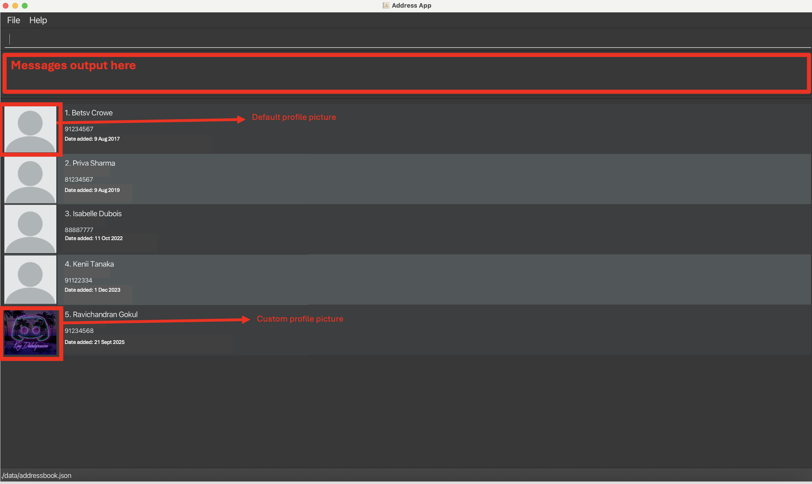

* UniContactsPro is a desktop application **Command Line Interface (CLI)** and a simple GUI.
* It is designed for university students to manage and organize their contacts. It helps students keep track of peers, professors, mentors and CCA members in one place, with features for searching and categorising contacts

* If you are interested in using UniContactsPro, head over to the [_Quick Start_ section of the **User Guide**](UserGuide.html#quick-start).
* If you are interested about developing UniContactsPro, the [**Developer Guide**](DeveloperGuide.html) is a good place to start.

**Acknowledgements**
* This project is based on the AddressBook-Level3 project created by the [SE-EDU initiative](https://se-education.org).

* Libraries used: [JavaFX](https://openjfx.io/), [Jackson](https://github.com/FasterXML/jackson), [JUnit5](https://github.com/junit-team/junit5)
